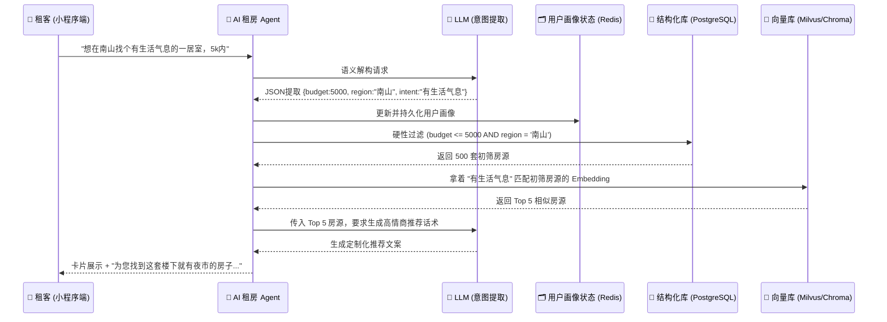

# 🏠 NestLink (筑梦安居)

-blue?style=for-the-badge)

**“先选室友，再找房子” —— 新一代基于 AI Agent 的青年租房与 Co-living 社区**

---

## 📖 项目简介

**NestLink（筑梦安居）** 是一个为Z世代青年量身打造的**微信小程序租房平台**。我们摒弃了传统租房软件“以房为本”的死板标签过滤，引入大模型（LLM）与专属 AI 租房 Agent。用户只需通过自然语言对话（如：“我想找个离高新园近、有烟火气、室友喜欢打游戏的合租房”），Agent 即可实时更新用户画像，并在底层运用 **“结构化过滤 + 向量模糊匹配”** 的混合检索方案，为您精准推荐最匹配的房子与“生活搭子”。

---

## 🌟 AI 产品思维与核心亮点

传统的租房平台让用户去适应表单，而 NestLink 让机器主动理解用户。

1. **🧠 渐进式画像构建**：告别繁琐的查户口式问卷。AI Agent 通过自然对话捕捉“显性条件”（预算、地段）与“隐性诉求”（睡眠质量、宠物友好）。
2. **🤝 场景颠覆（先选人，后选房）**：迎合Z世代“搭子文化”，基于 MBTI、作息规律与兴趣爱好前置匹配室友，直击“盲盒式合租”痛点。
3. **🔍 情感化模糊搜索**：“烟火气”、“文艺范”、“适合做饭”等无法被结构化标签定义的词汇，在这里都能被精准识别与映射。
4. **🛠️ 租后闭环管理**：提供房租/水电AA结算、值日排班表等 Co-living 协作工具，延伸服务生命周期。

---

## 🏗️ 项目架构

NestLink 采用行业前沿的 **Agent 智能体架构** 与 **混合检索 (Hybrid Search)** 技术。整个交互闭环均在微信小程序端无缝完成。

### 核心工作流图解

### 核心技术栈
- **前端 (小程序)**：Taro / Uni-app (支持多端编译) + WebSocket (流式对话呈现)
- **后端服务**：Python FastAPI / Node.js
- **大模型底座**：GPT-4o / Claude 3.5 / 国内 Qwen (负责意图识别与文案生成)
- **数据库**：
  - 传统关系库：`PostgreSQL + PostGIS` (处理多维地理空间相交与通勤测算)
  - 向量数据库：`Milvus` 或 `Pinecone` (处理语义级模糊检索)
  - 状态缓存：`Redis` (会话与长期记忆管理)

---

## 📊 市场背景与竞品分析

当前“保租房”与“市场化”双轨并行的格局下，青年长租市场的竞争正从“粗放式信息分发”转向“精细化社群运营”。NestLink 以极低的获客与审核成本实现了降维打击。

| 平台名称 | 核心模式 | 优势 | 核心劣势（痛点） | NestLink 的破局点 |
| :--- | :--- | :--- | :--- | :--- |
| **自如 (Ziroom)** | C2B2C 重资产包租 | 房源标准化、服务省心 | 租金溢价高、10%服务费、**盲盒式室友分配** | **主打先选室友的社交匹配**，降低合租矛盾 |
| **贝壳找房** | 传统居住经纪平台 | 房源库庞大、交易保障 | 居间中介费极高、**仅以“房”为核心过滤** | **纯免中介费**，引入性格/MBTI等“人”的维度 |
| **Wellcee (唯客)**| C2C 社交直租 | 无中介费、社区氛围极佳 | 受众小众高端、**缺乏租后深度生活管理工具** | **向租后延伸**，提供丰富的 Co-living 协作工具 |
| **豆瓣/同城超话** | 去中心化 BBS | 完全免费、可捡漏一手房 | **劣币驱逐良币**、虚假房源泛滥、纯文本搜索极差 | 引入 **AI 审核风控与真人认证**，清洗虚假房源 |

---

## 🚀 商业前景与变现路径

2024-2025年，长租公寓市场步入“量稳质升”期，重资产包租模式已被证明风险极高。NestLink 坚持**“轻资产运营 + 服务深耕”**战略，拥有清晰的商业变现蓝图：

1. **破冰期：流量与口碑裂变**
   - 迎合“搭子文化”与“降级/理性消费（拒交中介费）”，以社交匹配和免中介费作为天然获客杠杆，在高校毕业生和一线城市白领中快速积累早期种子用户。
2. **沉淀期：高频租后工具留存**
   - 传统的租房APP属于“极低频应用”（一年打开一次）。NestLink 创新性提供公共账本、排班表等 Co-living 工具，将低频的“租前行为”转化为高频的“租后日活工具”，建立极深的用户粘性。
3. **成熟期：O2O 增值服务变现（商业核心）**
   - 不在前端赚取一次性中介费，而是将流量引导至后端高频生活服务。
   - 接入第三方或自营的**搬家、深度保洁、家电维修、宽带办理**等服务，抽取合理的平台佣金。
   - 后期可面向房东/二房东提供“AI 智能管家”SaaS 套件实现 B 端收费。

---

## 📱 参与贡献 & 快速开始

本项目目前处于开发迭代阶段，欢迎对 AI Agent、全栈开发及产品设计感兴趣的伙伴加入！

